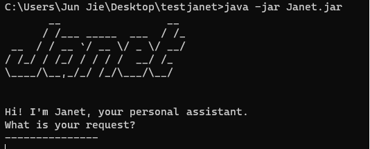

# Janet's User Guide

Janet is a desktop app for **managing tasks, optimized for use via a Command Line Interface** (CLI).

* [Quick start](#quick-start)
* [Features](#features)
    * [Adding a todo task: `todo`](#adding-a-todo-task-todo)
    * [Adding a deadline task: `deadline`](#adding-a-deadline-task-deadline)
    * [Adding a event task: `event`](#adding-a-event-task-event)
    * [Listing all tasks: `list`](#listing-all-tasks-list)
    * [Marking a task as 'completed': `mark`](#marking-a-task-as-completed-mark)
    * [Marking a task as 'uncompleted': `unmark`](#marking-a-task-as-uncompleted-unmark)
    * [Locating tasks by name: `find`](#locating-tasks-by-name-find)
    * [Deleting a task: `delete`](#deleting-a-task-delete)
    * [Exiting the program: `bye`](#exiting-the-program-bye)
    * [Saving the data](#saving-the-data)
* [FAQ](#faq)
* [Command summary](#command-summary)

--- 

## Quick start

1. Ensure you have Java `11` or above installed in your Computer.
1. Download the latest `Janet.jar` file [(here)](https://github.com/wjunjie01/ip/releases/tag/A-Release). 
1. Copy the file to the folder you want to use as the _home folder_ to store your data.
1. Open a command terminal, `cd` into the folder you put the jar file in, and 
use the `java -jar Janet.jar` command to run the application. 
A GUI (similar to the one shown below) should appear in a few seconds.

1. Type the command in the CLI and press enter to execute the command.
   
   * Some example commands to try:
     * `todo go for a walk`: Adds a To-do task.
     * `list`: Lists all tasks.
     * `mark 1`: Marks the first task as 'completed'.
     * `bye`: exits the app.
1. Refer to the [Features](#features) below for details of each command.

---

## Features

> [!WARNING]
> Any commands executed **MUST STRICTLY** follow the format specified.
>
> Any deviation in the format will result in an error.
<div style="background-color: #d1a8a5; border-left: 5px solid #a35c56; padding: 20px;">
    <strong>&#128161; WARNING: </strong> Any commands execute must STRICTLY follow the
    format specified. Any deviation in the format specified may result in 
    an error.
</div>

### Adding a todo task: `todo`

Adds a todo task to the task list. Todo tasks are tasks with no additional parameters.

Format: `todo TASK`

Examples:

* todo walk the dog
* todo read a book

Usage:
```
todo walk the dog
added: walk the dog
You now have 1 task in the list.
```

### Adding a deadline task: `deadline`

Adds a deadline task to the task list with a deadline to be completed by.

Format: `deadline TASK /by DEADLINE`

Examples:

* deadline walk the cat /by 4 November
* deadline finish assignment /by 2359
* deadline buy groceries for dinner /by 5pm

Usage:
```
deadline walk the cat /by 4 November
added: walk the cat
You now have 2 tasks in the list.
```

### Adding a event task: `event`

Adds an event task to the task list with a start and an end time.

Format: `event TASK /from START /to END`

Examples:

* event project meeting /from 2pm /to 4pm
* event birthday party /from 5pm /to 11pm
* event meeting conference at MBS /from 3pm /to 6pm

Usage: 
```
event project meeting /from 6pm /to 8pm
added: project meeting
You now have 3 tasks in the list.
```

### Listing all tasks: `list`

Shows a list of all tasks in the task list.

Format: `list`

Usage:

If the task list is empty, this message will be printed.

```
No task in your list, yay!
```

Otherwise, it will print all the tasks in it.

```
The tasks in your list are: 
1.[T][ ] walk the dog
2.[D][ ] WALK the cat (by: 4 November)
3.[E][ ] Walk the turtle (from: 6pm to: 8pm)
4.[E][ ] project meeting (from: 9pm to: 11pm)
```

### Marking a task as 'completed': `mark`

Marks a task as done.

Format: `mark TASKINDEX`

### Marking a task as 'uncompleted': `unmark`

Marks a task as incomplete.

Format: `unmark TASKINDEX`

### Locating tasks by name: `find`

Finds tasks whose names contain any of the keyword.

Format: `find KEYWORD`

* The search is case-insensitive. e.g. `abcd` will match with `ABCD`
* Only the task name is searched.
* Task names that contain partial keyword will be matched e.g. `AB` will match with `ABCD`

Usage:

* `find walk` returns tasks containing the keywords of `WALK`, `Walk` and `walk`.
* `find wa` will still achieve the same results.

```
Here are the matching task(s) in your list: 
---------------
1. [T][ ] walk the dog
2. [D][ ] WALK the cat (by: 4 November)
3. [E][ ] Walk the turtle (from: 6pm to: 8pm)
```

### Deleting a task: `delete`

Deletes the specified task from the task list.

Format: `delete TASKINDEX`

* Deletes the task at the specified `TASKINDEX`
* The index refers to the index number shown in the displayed task list.
* The index **must be within the list**
* The index **must be a positive integer** 1, 2, 3, ...

Usage: 
* `delete 1` deletes the 1st person in the task list.

```
Okay, I've removed the task
        [T][ ] walk the dog
You now have 2 task(s) in the list.
```

### Exiting the program: `bye`

Exits the program.

Format: `bye`

### Saving the data

The task list data are saved in the local hard disk automatically after any command that changes the data.
There is no need to save manually.

<div style="background-color: #a5c5d1; border-left: 5px solid #2e88ab; padding: 20px;">
    <strong>&#128161; NOTE: </strong> By default, the data file is stored in the file path ‘data/duke.txt’ in 
    the same folder as the jar file. If the file does not exist, running the jar file creates a new file in 
    the file path.
</div>

--- 

## FAQ

**Q:** How do I transfer my data to another Computer?

**A:** Install the app on the other computer and overwrite the empty data file 
it creates with the file that contains the data.

---

## Command summary

| **Commands** | **Examples**                                                                        |
|--------------|-------------------------------------------------------------------------------------|
| **todo**     | `todo TASK` <br/> e.g., `todo walk the dog`                                         |
| **deadline** | `deadline TASK /by DEADLINE` <br/> e.g., `deadline walk the dog /by 6pm`            |
| **event**    | `event TASK /from START /to END` <br/> e.g., `event walk the dog /from 6pm /to 8pm` |
| **list**     | `list`                                                                              |
| **mark**     | `mark TASKINDEX` <br/> e.g., `mark 1`                                               |
| **unmark**   | `unmark TASKINDEX` <br/> e.g., `unmark 1`                                           |
| **find**     | `find KEYWORD` <br/> e.g., `find walk`                                              |
| **delete**   | `delete TASKINDEX` <br/> e.g., `delete 1`                                           |
| **bye**      | `bye`                                                                               |

---
